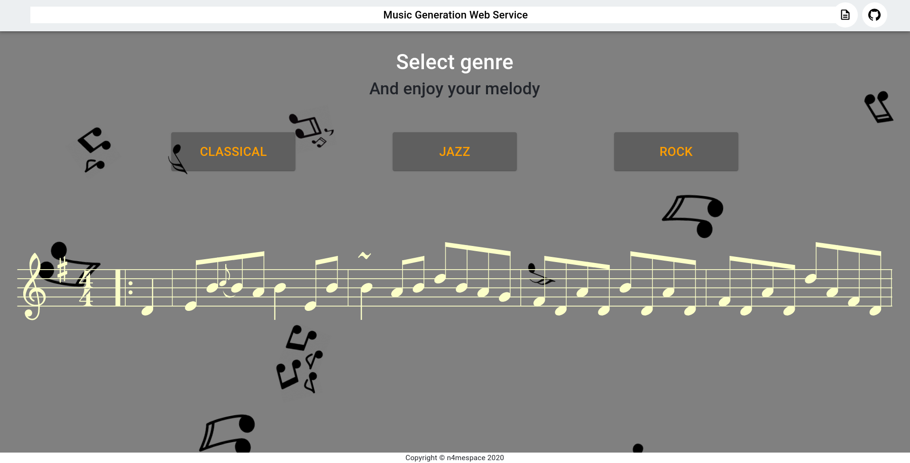

# MusicGenerationWebService

[](https://travis-ci.com/n4mespace/MusicGenerationWebService)

## Software Engineering Term Paper


# Зміст

1. [Вступ](#introduction)
2. [Технічне завдання](#techtask)
3. [Проектування](#design)
4. [Розробка](#development)
5. [Тестування](#test)
6. [Використання](#howto)
7. [Висновки](#conclusion)


##  1. Вступ <a name="introduction"></a>
### 1.1 Ціль проєкту

MGWS - веб сервіс, на якому користувач може прослуховувати музику згенеровану глубокою нейронною мережею типу "трансформер". Детальніше в цьому [ноутбуці](https://colab.research.google.com/drive/1C1bIClVhXkXy3mRwl3ozXImdYvRgGcwz?usp=sharing). Данні використані для "тюнингу" моделі можна скачати за [посиланням](https://drive.google.com/open?id=1Hbn8jQKIyJtHIbhGbQ0DrbAMha6OFWdM)

### 1.2 Реалізація

Для вебсервісу використовувалися такі фреймворки:

1. Серверна частина (python3):
* [Quart](https://pgjones.gitlab.io/quart/)

2. Клієнтська частина (js):
*  [React](https://ru.reactjs.org/docs/getting-started.html)

3. Нейронна мережа (python3):
* [gpt-2-simple](https://github.com/minimaxir/gpt-2-simple)


## 2. Технічне завдання <a name="techtask"></a>

### 2.1 Загальне завдання

Розробити вебсервіс, на якому користувач може слухати згенеровану нейронною мережею музику.

### 2.2 Функціональність

 - кілька жанрів музики на вибір.
 - можливість отримання згенерованої музики сторонніми сервісами через REST API.

### 2.3 Документація

 - JsDoc
```bash
>> cd client
>> npm run docs
```
 - PythonDoc
```bash
>> cd docs/PythonDoc
>> make html
>> sphinx-build -b rinoh source _build/rinoh
```

## 3. Проектування  <a name="design"></a>

### Проєктування графічного інтерфейсу користувача

Веб-сервіс побудований як SPA, зразок головної сторінки



## 4. Розробка  <a name="development"></a>
 ### TODO:
 * // що залишилося реалізувати
 
## 5. Тестування  <a name="test"></a> 

За допомогою бібліотеки [pytest](https://docs.pytest.org/en/latest/) та [pytest-asyncio](https://github.com/pytest-dev/pytest-asyncio) запускаємо тести командою:
```bash
>> pytest tests.py
```
Також автоматично тестування запускається після кожного коміту за допомогою інтеграції з [Travis-ci](https://docs.travis-ci.com/)

## 6. Використання  <a name="howto"></a> 

Успішно розгорнути проект можна:

1. За допомогою [poetry](https://python-poetry.org/) та [nvm](https://github.com/nvm-sh/nvm):
```bash
>> git clone https://github.com/n4mespace/MusicGenerationWebService
>> pip3 install poetry
>> cd server && poetry install && cd ../
>> nvm install v12.6
>> cd client && npm install && cd ../
>> chmod +x dev.sh
>> ./dev.sh
```
2. За допомогою [Docker](https://docs.docker.com/):
```bash
>> git clone https://github.com/n4mespace/MusicGenerationWebService
>> DOCKER_BUILDKIT=1 docker build -t mgws:latest .
```
та після білда запустити командою:
```bash
>> docker run --name mgws -it -p 8000:8000 --rm mgws:latest -e WORKER_NUM=1
```

## 7. Висновки  <a name="conclusion"></a> 

За допомогою розробки цього проекту покращив не тільки теоретичні знання в сфері програмування на python3 та js, але й набув нових навичок у використанні різних бібліотек для побудови веб-сервісу, також поглибив знання у сфері NLP
